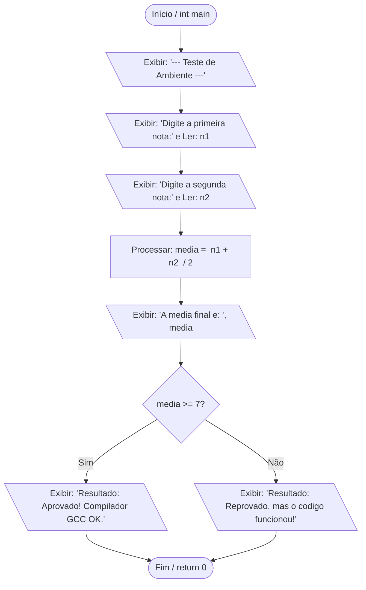

# Algoritmo para o cálculo da média e teste do compilador

```mermaid
graph TD
    A([Início / int main]) --> B[\Exibir: '--- Teste de Ambiente ---'\]
    B --> C[\Exibir: 'Digite a primeira nota:' e Ler: n1\]
    C --> D[\Exibir: 'Digite a segunda nota:' e Ler: n2\]
    D --> E[Processar: media =  n1 + n2  / 2]
    E --> F[\Exibir: 'A media final e: ', media\]
    F --> G{media >= 7?}
    G -- Sim --> H[\Exibir: 'Resultado: Aprovado! Compilador GCC OK.'\]
    G -- Não --> I[\Exibir: 'Resultado: Reprovado, mas o codigo funcionou!'\]
    H --> J([Fim / return 0])
    I --> J
```
